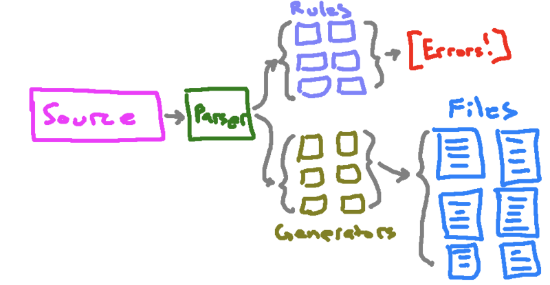
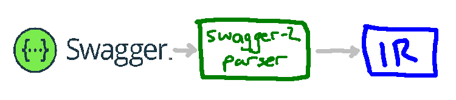
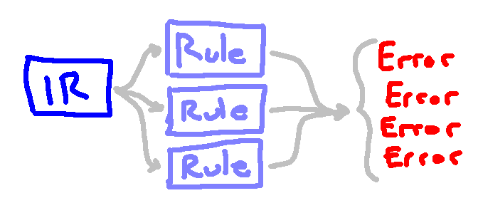
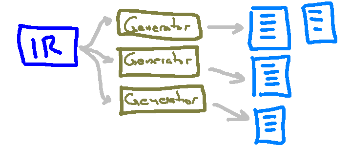
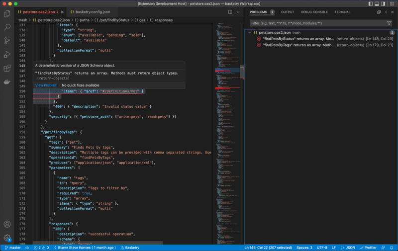
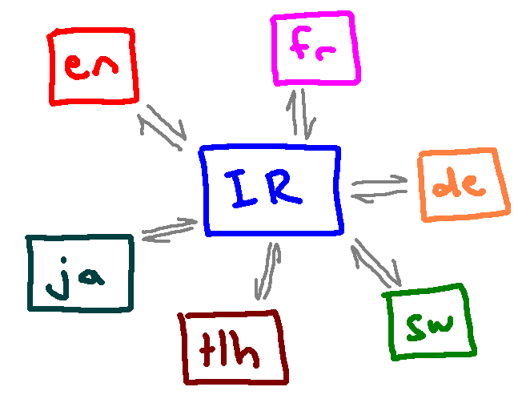
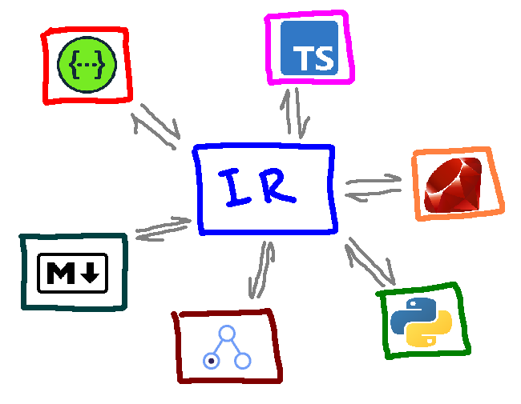

# Introducing Basketry

Basketry is the pluggable, service-oriented code-generation pipeline for any language. It starts with a Service Definition (think [Swagger/OpenAPI](https://swagger.io/), [API Blueprint](https://apiblueprint.org/), etc.) and generates code for your APIs.

Let's unpack that.

## Basketry is Pluggable

Basketry isn't one single tool but rather a collection of small tools that work together as a pluggable pipeline. Individually, each component follows the mantra of "[do one thing and do it well](https://en.wikipedia.org/wiki/Unix_philosophy)." Together, they comprise a powerful system for building service-oriented code.

A Basketry pipeline as a whole reads a Service Definition and outputs a set of code files. It does so by composing three types of components: Parsers, Rules, and Generators.

<!--truncate-->

### Parsers

Parsers sit at the beginning of the pipeline. They read a Service Definition and convert it into an intermediate representation (IR) that the rest of the pipeline can use. This IR is the common language that all components in the pipeline speak.

Parsers look at a specific Service Definition Language (SDL) and emit an Intermediate Representation (IR)This allows for parser pluggability. Suppose you have built and evolved a pipeline over time that is based on OpenAPI 2 (aka Swagger). The pluggability of Basketry pipelines allows you to seamlessly migrate from OpenAPI 2 to OpenAPI 3 while leaving the rest of your toolchain unchanged-once you build a Basketry pipeline, it can be used by plugging in any Parser.

### Rules

Rules provide the ability to enforce common API patterns and design guidelines for your services. They look at the whole service for one specific thing (say, ensuring that URLs are "kabab cased" or methods take pagination parameters) and then output a list of violations if any are found in the service. You can think of rules as a "linter" for your service interfaces.

Rules, like Parsers, use the intermediate representation (IR) to interact with the pipeline. This allows for rule pluggability. Because they don't know about the original source Service Definition, any rule can be composed into any pipeline.

[Basketry offers several standard rules](https://github.com/basketry/rules) to get you started but you can also include your own custom rules. This allows you to build and evolve an approach to API governance that is tailored to your team and your projects.

### Generators

Generators are the "business end" of the pipeline-they convert the Intermediate Representation (IR) into code. Similar to Parsers and Rules, Generators interact with the IR and not the original Service Definition source which means they can be plugged into any pipeline.
Rules look at the Intermediate Representation (IR) and emit code

## Basketry is Service-Oriented

There are many code generation toolchains out there. Some like [Yeoman](https://yeoman.io/) offer a generic platform for scaffolding new projects. [Create React App](https://create-react-app.dev/) does this but with a specific focus on getting started with React applications.
Basketry has a laser focus on building and maintaining service-oriented code. It provides functionality for managing the services that connect applications while being entirely hands-off with respect to the projects' overall architectures. This means that you can use Basketry with anything from Ruby on Rails, to Next.js, to your own custom in-house architecture.

### Building Services

> "Each bounded context has an explicit interface where it decides what models to share with other bounded contexts." - Sam Newman, Building Microservices

Service Definition Languages (SDLs) such as Swagger/OpenAPI are useful tools for defining such explicit interfaces.

Building fully-functional APIs is expensive whereas producing a description of an API is relatively cheap. Using an SDL in the initial design phase of a service allows for developers to rapidly iterate on API designs before committing significant time to writing code.
SDLs also provide a common language for communicating and getting feedback on API designs. Rather than produce human-oriented documents in formats like Google Docs or Confluence, developers can refine explicit, concrete representations of a service.

In the end, better, more explicit communication and design tools yield better products.

Basketry initially offers support in the API design phase. API design guidelines can be concretely expressed as Rules. These rules provide immediate, automated feedback if the design diverges from those guidelines.

Traditional "design, then build" SDLCs suffer from the fact that design artifacts (diagrams and documents) are inherently decoupled from the build phase. Developers might refer to the designs, but in the end, it is typical for the actual product to at least be slightly different than the original documented plans. This consumes resources producing documentation that isn't strictly followed which subsequently calls into question the trustworthiness and thus overall value of the documentation in the first place.

Basketry Generators address this by generating code directly from the plans. Service interfaces generated from the SDL are guaranteed to exist as a perfect representation of the design. In doing so, the traditional "design, then build" phases can be condensed into a more continuously iterative process. Changes to the design immediately and materially affect the software that is generated. As developers begin implementing the generated service interfaces and types, any iterations are made by rapidly applying changes to the design, which then completes the cycle.

[Basketry also offers a Visual Studio Code extension](https://marketplace.visualstudio.com/items?itemName=stevekonves.basketry-vscode) for aiding in the iterative design/build process.

### Maintaining Services

Basketry Rules address a key part of API governance: how do you safely evolve both the API and the design guidelines that drive them?
Rules for parameter names, URI patterns, and pagination requirements can help to prevent developers from building themselves into a corner. But more importantly, they ensure design consistency over the lifetime of a service. Code "ages" and maintainers come and go. Without guardrails, these changes manifest themselves in various, sometimes conflicting, design patterns.

Basketry assists in the API maintenance process by enforcing explicit yet evolvable rules. Thus, the design principles that govern your API can be committed alongside the code itself and automatically executed in your Continuous Integration pipeline. This ensures that the Rules as expressed are actually followed in the code.

But, as with the code, the committed Rules can also be evolved over time. A change to the Basketry pipeline's Rules must also be accompanied by a corresponding change to the service interface. The changes to Rules in source control are transparent as well as the correlated changes to the API.

In addition to [standard Basketry Rules](https://github.com/basketry/rules) or rules from the community, teams can write their own rules to govern their APIs.

## Basketry generates code in any language

Basketry can be used to read any Service Definition Language and output code in any language. Basketry pipelines can do this by approaching code generation as a linguistics problem. When tools like Google Translate take a phrase in Spanish and convert it to English, they don't technically translate it from Spanish to English. Instead, they first build an "intermediate representation" (IR) of the Spanish phrase and then recreate that representation using the syntax of the English language.

In a similar way, Basketry works by parsing the Service Definition Language into an Intermediate Representation of the service. Because of this, all components can seamlessly work together because they all only know about the intermediate representation.

Rules for enforcing pagination or naming conventions work in any pipeline, regardless of whether the output language is Typescript, Ruby, Kotlin, or a mixture of these and many more. And the languages need not be strictly for machines - generators can also be built to output things like human-readable documentation. This is a powerful tool for designing your APIs once and then offering clients in multiple languages to your consumers.

And lastly, this interoperability feeds back into pluggability. Once you establish a set of rules that define and automate your API design principles, those rules are still 100% useful even if you want to migrate from one SDL to another. For example, a pipeline developed based on a Swagger/OpenAPI version 2.0 is can be seamlessly reused with OpenAPI version 3. Rules designed to "lint" an API originally written in Ruby can be reused without modification in a Typescript API.
