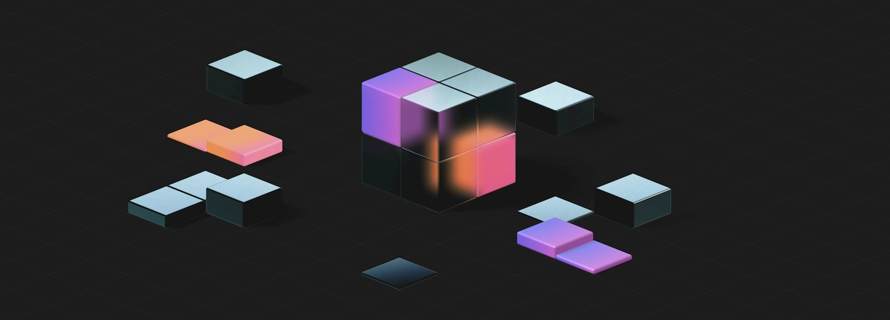

# Basketry 0.2 — Built for Builders 🧺⚒️

Basketry 0.2 is here, and it’s all about making life better for builders. It’s better for the developers using Basketry to generate code, but also for the engineers creating the parsers, rules, and generators that power the ecosystem.

{/* truncate */}

This release marks a turning point: Basketry remains a powerful tool you can use out of the box, but now it’s a clearer, more approachable platform you can build on. With a stronger foundation, a formalized specification, and new capabilities designed for real-world APIs, Basketry 0.2 makes it easier than ever to extend, customize, and integrate into your own workflows.

## TL;DR

- **Formal IR specification** — The Intermediate Representation now has an authoritative, declarative definition in JSON Schema. Explore the [full IR specification](/docs/specification/v0.2).
- **Single source of truth** — Basketry’s core types, validation logic, and published spec are all generated from that document, ensuring they stay perfectly in sync.
- **Expanded capabilities** — Richer type modeling, more complete descriptions, precise literal handling, and support in the IR for multi-file service definitions.
- **Comming up next** — `stdio` plugins, MCP support, and broader integration possibilities. Check out [the roadmap](/roadmap).

## From Power Tool to Platform

Basketry’s humble begining was a way to take a service definition and turn it into working code. Over time, it evolved into a fully pluggable ecosystem—a place where parsers, rules, and generators can be composed into pipelines that fit any team’s needs.

With 0.1, the priority was locking in a rock-solid core pipeline. In 0.2, the focus shifts to empowering the people who build on top of it. That means clearer contracts between components, better documentation of how the pieces fit together, and a foundation that invites more contributors to create their own extensions.

This evolution didn’t happen in a vacuum. The new IR reflects feedback from real teams building real, battle-tested APIs. Every change, from how types are modeled to how services can span multiple files, is grounded in solving actual problems encountered in production. The result is a platform that’s not just technically stronger, but better aligned with the realities of modern API development.

## The Heart of the Upgrade — A Formal IR Specification

At the center of every Basketry pipeline is the Intermediate Representation: the shared data structure that connects parsers, rules, and generators. In 0.2, that structure now has an authoritative, declarative definition in JSON Schema, and everything else is generated from it.

The Basketry core types, the formal specification on the website, and even the validation logic are all derived from the same single source of truth. Because they’re generated, they stay perfectly in sync—no drift, no ambiguity, no guesswork.

This is Basketry’s philosophy in action: start with a declarative document, then generate the world. By applying this principle to the core IR itself, we’ve made it easier than ever to:

- Trust the spec as the definitive contract for every component
- Build and validate generators, rules, and parsers with total confidence
- Extend the ecosystem without worrying about hidden inconsistencies

The IR has always been the framework that ties Basketry together. Now it’s generated from its own blueprint, and that makes it stronger, clearer, and more dependable than ever.

You can view the [formal specification in the docs](/docs/specification/v0.2).

## New Capabilities for Real-World APIs

While the new IR specification is the centerpiece of 0.2, it’s far from the only upgrade. This release also delivers features aimed squarely at the challenges of building and maintaining production-grade APIs.

Key highlights include:

- **Multi-file service definitions** — Design services that span multiple source files without losing clarity or cohesion, enabling large teams to work in parallel without stepping on each other’s changes.
- **Richer type modeling** — Improved handling of unions, constants, defaults, nullability, and other type constraints gives generators more context to produce accurate, expressive output.
- **More features have descriptions** — Additional IR elements now carry human-readable descriptions from the source, allowing generators to surface richer documentation for developers.
- **More precise handling of literal values** — Improved fidelity for constants, defaults, and other literal values ensures generated code reflects the source documents exactly as authored.

These capabilities unlock new possibilities for generator authors and make it easier to capture the nuances of complex APIs without bending the rules of the underlying specification.

## Ecosystem Impact

Basketry 0.2 isn’t just an upgrade for individual developers, it’s a step forward for the entire ecosystem. By formalizing the IR, strengthening the core, and expanding what the platform can represent, we’ve created conditions where the whole community can build faster, safer, and with greater confidence. The changes in this release don’t just unlock new technical capabilities; they make it easier for people to participate meaningfully in the Basketry ecosystem.

First, the authoritative IR spec levels the playing field. In previous versions, understanding the IR required digging through code or relying on examples from other components. Now, every contributor, whether they’re writing a generator in TypeScript, a parser in Python, or a set of rules in Go, starts with the same clear, verifiable contract. This lowers the learning curve for new contributors and removes guesswork for experienced ones, resulting in components that are more consistent, more interoperable, and easier to maintain.

Second, the improvements in type modeling and literal value fidelity give component authors the ability to generate more accurate and expressive outputs. When unions, constants, and defaults are modeled with precision, generators can confidently produce code that matches the source specification exactly. This makes custom tooling more predictable and reduces the maintenance burden over time which is especially important for teams managing multiple APIs or large, evolving services.

Third, features like multi-file service definitions make Basketry more adaptable to the way real teams work. Large organizations often split their service definitions across multiple files for clarity, ownership, or workflow reasons. By supporting this directly in the IR, Basketry enables those teams to keep their established practices while still reaping the benefits of automated code generation and validation. That flexibility helps the platform integrate more naturally into diverse environments without forcing teams to compromise on structure.

Together, these changes set the stage for faster ecosystem growth. Contributors can onboard more quickly, maintainers can upgrade more confidently, and teams can adapt Basketry to their unique needs without fighting the tooling. The clearer the foundation, the more innovative the community can be on top of it — and 0.2 delivers one of the clearest foundations Basketry has ever had.

## The Road Ahead

With 0.2 in the wild, our sights are set on 0.3—a release that will make Basketry truly language-agnostic, not just in what it generates, but in what it’s built with. The centerpiece of this work is a shift to `stdio`-based plugin execution. Today, Basketry loads plugins as Node.js modules. That works fine for Node-centric workflows, but it puts up barriers for developers working in other ecosystems. In 0.3, plugins will be able to run as standalone executables that communicate over standard input/output, making it possible to write generators, rules, and parsers in Go, Python, Rust, or anything else that can read and write JSON.

This change also unlocks something even bigger: MCP (Model Context Protocol) support. Because `stdio` execution will use JSON-RPC under the hood, it will be trivial to turn the Basketry CLI and any Basketry component into a local MCP server. That means Basketry will integrate directly with AI-assisted developer tools, giving them the ability not only to generate code, but to assemble and run automated pipelines that generate code. You won’t find this capability in any other code generation toolchain available today.

Here’s what to expect in 0.3:

- **`stdio`-based plugin execution** — Fully decouples plugins from the Node.js runtime.
- **Plugin fallback logic** — For backwards compatibility, Basketry will still load Node.js modules if needed (with deprecation warnings).
- **Standard plugin updates** — All first-party generators, parsers, and rules will support `stdio` execution.
- **Component protocol specification** — The communication protocol for `stdio` components will be formally defined to ensure long-term stability and tooling support.
- **MCP enablement** — Basketry will be MCP-ready from day one, making it possible for AI tooling to build, customize, and orchestrate pipelines automatically.

Version 0.3 is planned for later this year and will mark another major leap forward in Basketry’s flexibility, accessibility, and integration potential setting the stage for entirely new ways to build software.

## Try It, Build on It, Shape It

Basketry 0.2 is ready for you to use today whether you’re generating code from existing specs, writing your own generators and rules, or exploring what’s possible with the new IR. Upgrade to the latest version, check out the [IR specification](/docs/specification/v0.2), and see how the changes fit into your workflow.

If you maintain a Basketry component, now’s the perfect time to update it for 0.2 and take advantage of the new capabilities. And if you’ve been thinking about creating something new—a generator, a parser, a custom rule set—the clearer foundation in 0.2 makes it easier than ever to get started.

Your feedback is what helps shape the roadmap. Share your ideas, report issues, or contribute directly through [GitHub](https://github.com/basketry). The ecosystem grows stronger with every new voice and every new component. And we can’t wait to see what you build!

---

This article was written by a human. Editing and proofreading were performed with the assistance of one or more large language models.
